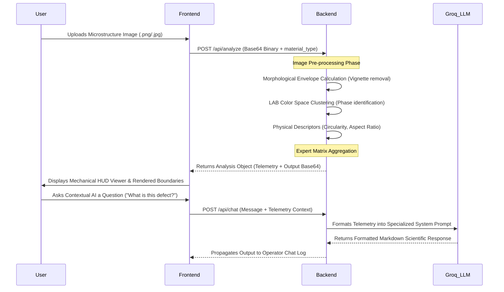

# <div align="center">MicroAI • Master Craft Metallurgical Engine</div>
<div align="center">
  <i>Sci-Fi Mechanical HUD Interface for Advanced Microstructure Analysis</i>
</div>

<br />

<div align="center">
  
  
  
  
  
  
</div>

<br />

Welcome to **MicroAI**, an advanced materials engineering and metallurgical characterization suite. It employs deep-tech algorithmic scanning coupled with physical descriptors (grain boundaries, aspect ratios, LBP textures) and large language model expert systems to classify, quantify, and analyze metallic microstructure samples with uncompromised accuracy.

---

## 🗂️ 1. Complete Tree Directory Structure

The project employs a completely decoupled Monorepo structure, safely segregating the Python Analytical Engine from the React presentation layers.

```text
MicroAI/
├── backend/                     # [SYS_CORE] Analytical Engine
│   ├── main.py                  # Core FastAPI process & API Router
│   ├── requirements.txt         # Pip dependency manifest
│   ├── test_upload.py           # Integrity/testing suite for image upload
│   └── venv/                    # Isolated Python Environment
└── frontend/                    # [SYS_HUD] Master-Craft Presenter
    ├── app/                     
    │   ├── analyze/             # Live execution environment UI
    │   ├── analysis/[id]/       # Contextual Viewer + Expert AI Chat
    │   ├── compare/             # Differential Target System (Dual-Pane)
    │   ├── reports/             # Vault / Document Generation Zone
    │   ├── settings/            # System Configuration Matrix
    │   ├── layout.tsx           # Global HUD Wrapper & Navigation
    │   ├── page.tsx             # Main System Dashboard (Command Center)
    │   └── globals.css          # Tailwind configurations & Custom clip-paths
    ├── lib/                     
    │   └── mock-data.ts         # Telemetry simulators & Data structs
    ├── public/                  # SVG Icons & Static layout telemetry
    └── package.json             # NPM node dependency manifest
```

---

## ⚙️ 2. Comprehensive Tech Stack

The architecture guarantees blistering fast UI responsiveness and massive backend data-crunching capabilities.

| Domain                 | Technology / Framework       | Usage / Rationale                                                                 |
|------------------------|------------------------------|-----------------------------------------------------------------------------------|
| **Frontend Core**      | **Next.js 14**               | Handles page rendering, hydration, and routing constraints natively.              |
| **UI Presentation**    | **React 19**                 | Component lifecycle management and hook state handling.                           |
| **HUD Aesthetics**     | **TailwindCSS 4**            | Allows hyper-rapid utility design, targeting borders, glows, and geometric clips. |
| **Data Viz**           | **Recharts / Mermaid**       | Translates complex grain boundary telemetry into readable vectors.                |
| **Document Export**    | **html2pdf.js**              | Exports `div` references directly to engineered, presentation-ready PDFs.         |
| **Backend Core**       | **Python 3.11**              | High performance memory allocation for manipulating large matrices.               |
| **Web Server**         | **FastAPI**                  | Strict typing and asynchronous performance using Uvicorn.                         |
| **AI Processing**      | **Groq (Llama-3.3-70b)**      | Expert metallurgical reasoning system parsing morphological characteristics.        |
| **Matrix Processing**  | **skimage / OpenCV**         | Morphology extraction, background envelopes, LBP texture analysis.                |

---

## 📡 3. Application Flow & Architecture Flowsheet

This chart visualizes the precise lifecycle of an image uploaded by the Operator, parsed through the Engine, and evaluated by the AI.



---

## 👨‍🔬 4. User Flow Operations

| Operation Phase                  | Action Steps                                                                                               |
|----------------------------------|------------------------------------------------------------------------------------------------------------|
| **1. Initialization**            | Operator lands on the `/` Command Center dashboard watching telemetry roll in.                             |
| **2. Target Acquisition**        | Operator moves to `/analyze`, configures Scale Factor (um/px) and specifies base Material Family.          |
| **3. Processing Execution**      | Engine begins crunching. Live logs display terminal output. Dual-progress bars fill geometrically.         |
| **4. Tactical Review**           | System routes to `/analysis/[id]`. Operator slides interactive `<clipPath>` UI over the raw/analyzed image. |
| **5. AI Briefing**               | Operator opens Chat terminal. Submits raw inquiries about structures. Engine responds in Rich Markdown.    |
| **6. Archival Validation**       | System locks findings. Operator exports to PDF. File lands in `/reports`.                                  |

---

## 🧪 5. Core Algorithmic Functions

### 🟢 `image_analysis.py` (The Brain)
Extracts critical metrics from raster data.
- **`analyze_microstructure()`**: The master entrypoint. Coordinates grayscale conversion, CLAHE scaling, Otsu thresholding, LAB phase clustering, and blob measurement.
- **Morphological Background Corection**: Employs a custom `disk` envelope filter using scikit-image to normalize illumination gradients and prevent edge artifacts.
- **Shape Profiling**: Converts standard blobs into properties like Roundness, Density, and Eccentricity via OpenCV region props.

### 🔵 `AnalysisViewerPage` (`/analysis/[id]/page.tsx`)
The primary Operator HUD. 
- **`exportToPDF()`**: Snaps a frozen context of the specific DOM React Reference and fires it to a print-ready binary.
- **`react-markdown` Rendering**: Intercepts the raw LLM responses and compiles them safely into Tailwind standard `prose`, protecting against escaping tags while delivering HTML tables and code flowsheets.
- **Slider Sync**: Overlays images identically by computing CSS `clip-path: inset(0 X% 0 0)` linked to mouse coordinates.

### 🔴 Compare Matrix (`/compare/page.tsx`)
The Comparative Differential System.
- Interrogates multiple analysis IDs, triggering proportional bar fills highlighting the delta between Grain Sizes and Defect Percentages of separate alloys.

<br/>

<div align="center">
<i>"To engineer the future, one must first precisely characterize the present."</i>
<br />
<code>> SYS_ADMIN.AUTH(OMEGA_LEVEL)</code>
</div>
